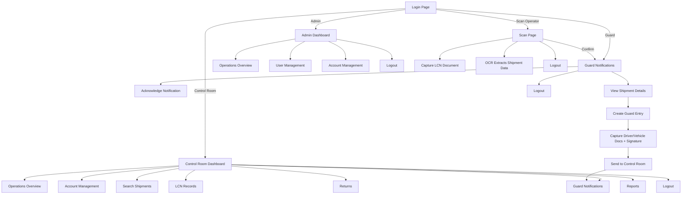

Got it ✅ — I’ll turn your full draft into a **polished GitHub-ready `README.md`** that’s properly formatted with markdown anchors, emojis, code blocks, flow diagrams, and copy-paste-ready sections.

Here’s the complete version you can drop into your repo:

```markdown
# 📦 Dulux Load Control System (LCS)

[](https://dotnet.microsoft.com/)  
[](https://learn.microsoft.com/en-us/sql/ssms/sql-server-management-studio-ssms)  
[](https://azure.microsoft.com/)  
[](https://visualstudio.microsoft.com/)  

A web-based **Load Control Management System** built with **ASP.NET MVC (.NET Framework)** and **SQL Server (SSMS)**, with integrations for **Azure Blob Storage** and **Azure Computer Vision OCR**.  
This system manages logistics operations with four user roles: **Admin**, **Control Room**, **Scan Operator**, and **Guard**.  

---

## 📑 Table of Contents
1. [Project Overview](#-project-overview)  
2. [Key Features](#-key-features)  
3. [Tech Stack](#-tech-stack)  
4. [Project Structure](#-project-structure)  
5. [Setup Instructions](#️-setup-instructions)  
6. [Deployment](#-deployment-webdeploy)  
7. [User Roles & Flows](#-user-roles--flows)  
8. [System Flow Diagram](#-system-flow-diagram)  
9. [Reports](#-reports)  
10. [Demo](#-demo)  
11. [Contributors](#-contributors)  

---

## 🚀 Project Overview
The **Dulux Load Control System** streamlines shipment monitoring, guard validations, and returns management.  
It provides an **operations overview dashboard**, OCR-enabled document scanning, guard verification, and reporting functionality.  

---

## ✨ Key Features
- 🔑 **Role-based login** (Admin, Control Room, Scan Operator, Guard)  
- 📊 **Operations overview dashboard** with graphs, stats, and reports  
- 📦 **Shipment & LCN (Load Control Number) management**  
- 🔍 **Search and filter shipments by multiple parameters**  
- 🖼 **OCR integration with Azure Computer Vision** to extract shipment data from scanned documents  
- 🔔 **Real-time notifications** between Scan Operators, Guards, and Control Room  
- 📄 **Reports** (LCN, employees, returns, guards) with CSV export  
- 📂 **Returns management** with add/search functionality  
- 🔒 **User management** with logs of actions, login/logout history  

---

## 🛠 Tech Stack
- **Framework:** ASP.NET MVC (.NET Framework on Windows)  
- **Database:** SQL Server (SSMS)  
- **Cloud Storage:** Azure Blob Storage  
- **OCR / AI:** Azure Computer Vision  
- **Deployment:** Web Deploy (IIS/Azure)  
- **IDE:** Visual Studio  
- **Plugins:** NuGet packages + Azure SDK integrations  

---

## 📂 Project Structure
```

/LoadControlSystem
├── Controllers        # MVC Controllers for each module
├── Models             # Database models (Entity Framework / Data Layer)
├── Views              # Razor views (Login, Dashboard, Reports, etc.)
├── Scripts            # Client-side scripts
├── Content            # CSS, images, static files
├── Services           # Azure Blob + OCR integration
├── Reports            # Report generation logic
└── README.md          # Project documentation

````

---

## ⚙️ Setup Instructions

### 1. Prerequisites
- Windows 10/11  
- Visual Studio (with ASP.NET & Web Development workload)  
- SQL Server Management Studio (SSMS)  
- Azure account with:  
  - Blob Storage container  
  - Computer Vision resource (API key + endpoint)  
  - Web App service for deployment  

### 2. Clone the Repository
```bash
git clone https://github.com/your-org/dulux-load-control-system.git
cd dulux-load-control-system
````

### 3. Configure Database

* Open **SSMS**
* Create a new database: `LoadControlDB`
* Run the SQL scripts from `/DatabaseScripts` (if available).
* Update the connection string in `Web.config`:

```xml
<connectionStrings>
  <add name="DefaultConnection" 
       connectionString="Server=YOUR_SERVER;Database=LoadControlDB;User Id=YOUR_USER;Password=YOUR_PASSWORD;"
       providerName="System.Data.SqlClient" />
</connectionStrings>
```

### 4. Configure Azure Blob Storage

```xml
<appSettings>
  <add key="AzureBlobConnectionString" value="YOUR_CONNECTION_STRING"/>
  <add key="AzureBlobContainer" value="lcns-documents"/>
</appSettings>
```

### 5. Configure Azure Computer Vision

```xml
<appSettings>
  <add key="ComputerVisionEndpoint" value="YOUR_ENDPOINT"/>
  <add key="ComputerVisionKey" value="YOUR_API_KEY"/>
</appSettings>
```

### 6. Build & Run

* Open solution in **Visual Studio**
* Set startup project → Run with IIS Express
* The app should launch at:

  ```
  http://localhost:xxxx/
  ```

---

## 🌐 Deployment (WebDeploy)

1. Publish the project from Visual Studio (`Build > Publish`)
2. Select **Web Deploy** as publish method
3. Use Azure Web App publish profile (`.publishsettings`)
4. Deploy → verify app running on:

   ```
   https://yourapp.azurewebsites.net/
   ```

---

## 👥 User Roles & Flows

### **Admin**

* Login → Operations Overview
* View metrics, graphs, total captures
* Manage users (username, email, last login/logout, actions)
* Manage personal account
* Logout

### **Control Room**

* Login → Operations Overview
* Manage personal account
* Search shipments by filters
* View guard notifications (status, PSIRA, driver info)
* Manage LCN records (status, shipment, delivery, image, filters)
* Returns page (add/view/search returns)
* Reports (LCN, employees, returns, guards)
* Logout

### **Scan Operator**

* Login → Scan page
* Capture LCN document via camera
* OCR extracts shipment data (shipment no., delivery no., qty, route, carrier)
* Confirm/cancel → if confirmed → notify Guard
* Logout

### **Guard**

* Login → Notifications page
* Acknowledge new LCN captured
* View shipment details → Create Guard Entry
* Fill driver, vehicle, trailer info
* Capture driver/vehicle docs + signature
* Accept + send to Control Room
* Logout

---

## 🔄 System Flow Diagram



---

## 📊 Reports

* **LCN Report:** Detailed load control data, exportable as CSV
* **Employees Report:** All registered employees with load distributions
* **Returns Report:** Return data breakdown, anomaly tracking
* **Guards Report:** Guard assignments, card numbers, acceptance statuses

---

## 🎥 Demo

👉 Watch the **YouTube Demo**: *(replace with your link once uploaded)*

```
https://youtube.com/your-demo-link
```

---

## 🤝 Contributors

* **Chloe Stanley** – Lead Developer (current maintainer)
* **Tushar** – Previous Developer

